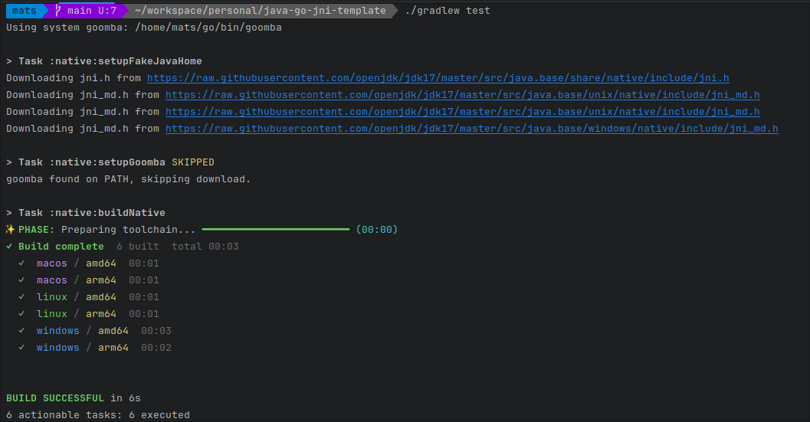

# Golang + Java + Goomba = ❤️
This template/example repository demonstrates how to use [Goomba](https://github.com/pixelib/goomba) to make **true** cross-platform JNI libraries (linux/windows/macos for both x86_64 and arm64) with a single codebase.



Key features:
- **Single codebase**: Write your JNI code once in Go, and Goomba will handle the rest.
- **Cross-platform**: Build for Linux, Windows, and macOS with ease.
  - You do **NOT** need to have Go installed on your CI/machine to build the JNI libraries. Goomba will handle the Go toolchain for you.
  - You do **NOT** need to be running a Mac to build for macOS. Goomba will handle cross-compilation for you. The output jar will work on all platforms without modification.
  - The output jar will contain native libraries for all platforms, and the correct one will be loaded at runtime based on the user's OS and architecture. You don't need to ship multiple jars or have users worry about which one to use.
  - Goomba doesn't need to be installed on your system, the Gradle config will download and use the correct version of Goomba for you.
  - You do not need to have cross-platform JDK headers installed on your system. A `java_home` will be mocked by the gradle config with the needed headers for all platforms, Goomba will link from there.
  - Build process will run on linux, windows and mac out of the box (even when just running `./gradle test` without any special configuration). You don't need to set up any special environment variables or configurations to build for different platforms.

## Quick start

Build the native libs and run the tests on your current machine:

```sh
./gradlew test
```

Build just the JNI libraries (all platforms/arches):

```sh
./gradlew :native:buildNative
```

Build the Java jar (includes the native libs under resources):

```sh
./gradlew :java:jar
```

## How it works

1. The Go code exposes JNI functions using cgo export names.
2. Goomba builds a c-shared library for a full platform/arch matrix.
3. The Gradle task copies the outputs into `java/src/main/resources/_native/...`.
4. `NativeLoader` picks the correct binary at runtime and loads it.

The result is a single jar that contains all native binaries, and the runtime picks the right one automatically.

## Project layout

```
native/                      Go JNI implementation (cgo + helpers)
java/                        Java wrapper + tests
java/src/main/resources/
  _native/<platform>/<arch>/ native (or native.exe on Windows)
```

Key files:

- `native/native.go`: JNI exports (`Java_dev_pixelib_gojni_embedded_EmbeddedApplication_*`)
- `java/src/main/java/dev/pixelib/gojni/embedded/EmbeddedApplication.java`: Java native methods
- `java/src/main/java/dev/pixelib/gojni/embedded/NativeLoader.java`: runtime loader
- `native/build.gradle`: Goomba bootstrap + build matrix

## Build output

The native build writes artifacts to:

```
java/src/main/resources/_native/<platform>/<arch>/
```

For example:

```
_native/linux/amd64/native
_native/macos/arm64/native
_native/windows/amd64/native.exe
```

## Extending the example

Add a new native method:

1. Declare a `native` method in Java (e.g. in `EmbeddedApplication`).
2. Add the JNI export in Go using the correct name signature.
3. Rebuild with `./gradlew :native:buildNative` or `./gradlew test`.

## Notes

- Goomba is fetched automatically if it is not on your PATH.
- JNI headers for all platforms are downloaded into a fake JAVA_HOME for cross-compilation.
- No local Go install is required (Goomba downloads it if missing).

## License

MIT (same as Goomba)


